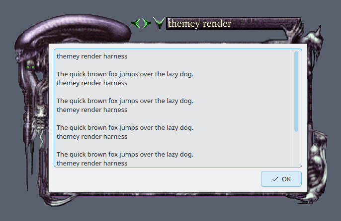
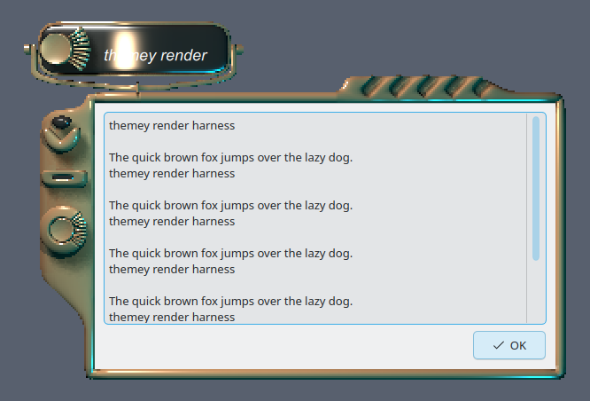
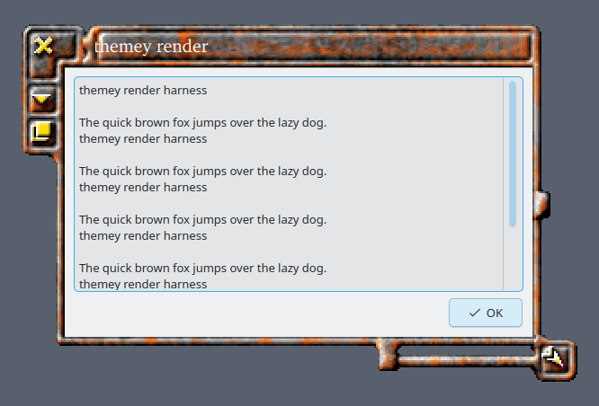
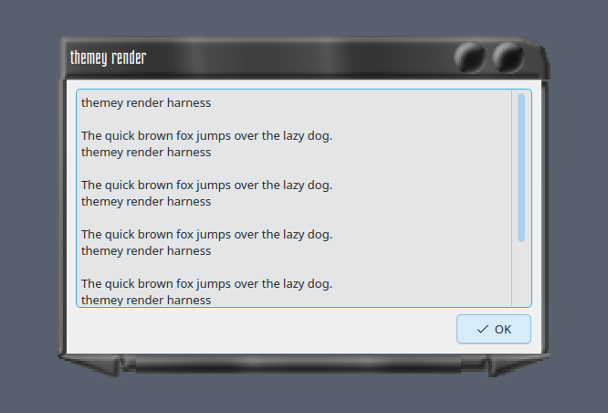
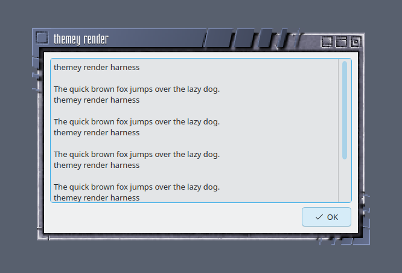
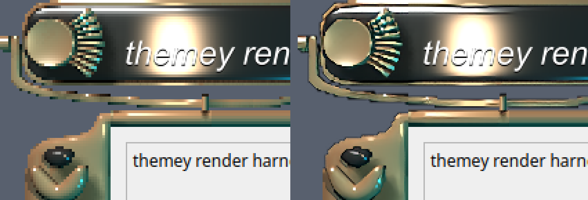
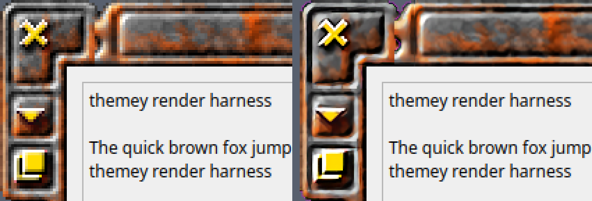
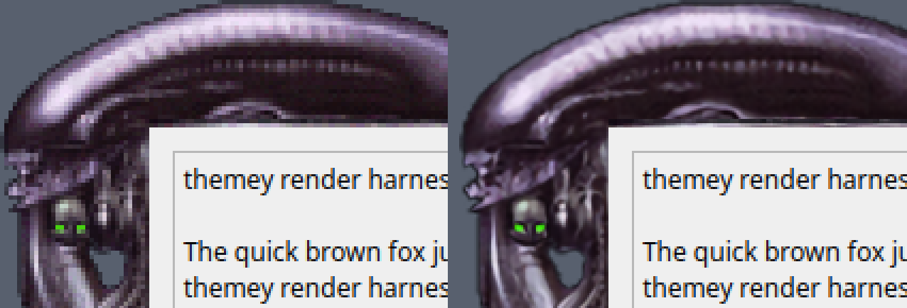
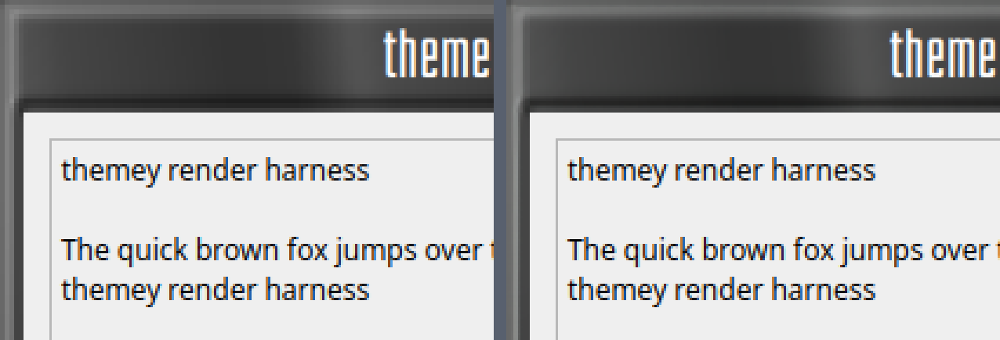

# themey

Convert Enlightenment DR16 (E16) `.etheme` archives into installable KDE
Plasma 6 themes.

themey reads the legacy E16 config grammar (`__BORDER`, `__ICLASS`,
`__TCLASS` blocks) and emits a complete modern KDE theme — window
decoration, color scheme, wallpaper, Plasma Style, and XCursor pointer set
— bundled as a one-click Plasma Global Theme. Point it at a 2009-era E16
theme and within seconds your Plasma 6 desktop is visibly wearing it:
frame, colors, panel, wallpaper, and cursor together.



*The E16 theme `Aliens`, converted and screenshotted by `themey render`
inside a real headless KWin session — that biomechanical frame is E16
border art drawing an actual Plasma 6 window.*

### Four more, same pipeline

<table>
  <tr>
    <td width="50%"></td>
    <td width="50%"></td>
  </tr>
  <tr>
    <td align="center"><b>e13</b></td>
    <td align="center"><b>OldE</b></td>
  </tr>
  <tr>
    <td width="50%"></td>
    <td width="50%"></td>
  </tr>
  <tr>
    <td align="center"><b>Obsidian</b></td>
    <td align="center"><b>BlueSteel</b></td>
  </tr>
</table>

None of those layouts is expressible as a stock Plasma titlebar, which is
why the default backend is a QML decoration that replays E16's part model
rather than an SVG theme clamped to KWin's border brackets.

All five images are `themey render --plugin qml` output. The window pixels
are untouched; the only edit is compositing each transparent render onto a
flat background and cropping to content, so they stay legible in both light
and dark themes.

```
$ themey Aliens.etheme
Installed:       /home/you/.local/share/kwin/decorations/themey_Aliens
Installed (colors): /home/you/.local/share/color-schemes/themey_Aliens.colors
Installed (cursors): /home/you/.icons/themey_Aliens-cursors
Installed (plasma style): /home/you/.local/share/plasma/desktoptheme/themey_Aliens
Installed (bundle):  /home/you/.local/share/plasma/look-and-feel/themey_Aliens
Preview:   /home/you/.local/share/themey/previews/Aliens.html
Report:    /home/you/.local/share/themey/previews/Aliens.report.txt
Apply via System Settings - Window Decorations - Aliens, or: themey apply Aliens
Colors:    pick 'Aliens (themey)' under System Settings - Colors
Cursors:   pick 'Aliens (themey)' under System Settings - Cursors
Global theme: themey_Aliens — apply: themey apply Aliens
```

## Status

Working today:

- `.etheme` parsing (lexer, parser, AST) with hardened archive extraction
- **QML decoration backend (default)** — an E16-faithful KWin/Decoration
  KPackage: unclamped borders, text-sized title plaques, side-border button
  stacks, theme TTF fonts, fractional `--scale`, and two opt-in smoothing
  upscalers (in-tree hqx, or waifu2x-ncnn-vulkan when installed — see the
  [before/after figures](#waifu2x-upscaling-optional))
- **SVG decoration backend** (`--backend svg`) — the original Aurorae SVG
  theme (`decoration.svg`, `<name>rc`, button SVGs); kept as an escape hatch,
  clamped to the KWin Border-size brackets
- Color scheme sampled from the theme's own border art, installed as a
  KColorScheme `.colors` file
- Wallpaper packages — one per E16 background image, largest becomes the
  Global Theme default
- XCursor pointer theme via `xcursorgen` (graceful skip when the tool is
  missing)
- Plasma Style (desktop theme) — panel, popup, tooltip and pager chrome
  sliced from the theme's own art, sparse by design (Plasma falls back to
  a re-tinted Breeze per missing element)
- The whole thing bundled as one Plasma Global Theme (Look-and-Feel package)
- Atomic install under `~/.local/share/...`, idempotent on re-run
- Self-contained HTML preview with an embedded mock-window PNG
- `report.txt` recording what was preserved, approximated, and skipped
- `themey apply <name>` — apply the full Global Theme (or `--deco-only` for
  just the window decoration) to the live KWin session, including E16's
  pager, iconbox and dragbar panels, plus `themey apply --revert`
- A floating, centred **dock** in the theme's own iconbox art
  (`themey dock`, or `--dock` on apply/convert) — themey's `org.themey.dock`
  applet, an icons-only task manager that zooms on hover
- `themey <theme>.etheme --apply` — convert, install and apply in one
  command
- `themey render` — screenshot a theme inside a headless nested KWin
  (`--target deco`/`style`/`pager`/`dock`)

Not built: batch conversion (`themey --all <dir>`).

## Requirements

- Linux with KDE Plasma 6 (developed against 6.6.4–6.6.6)
- Python 3.11+ and [uv](https://docs.astral.sh/uv/)
- Optional, for `themey apply`: `kwriteconfig6`/`kreadconfig6`, `qdbus6`,
  and — for the full Global Theme apply — `plasma-apply-lookandfeel`,
  `plasma-apply-colorscheme`, `plasma-apply-desktoptheme`, and
  `plasma-apply-wallpaperimage` (all ship with Plasma). The last three are
  only invoked when the conversion actually produced that artifact: the
  color scheme and Plasma Style are applied explicitly because a
  Look-and-Feel apply does not displace an explicit user-layer setting, and
  the wallpaper tool only runs for a theme whose default background was
  tiled in E16. `dbus-send` is used to tell running applications that the
  icon theme or application style changed; without it they pick the change
  up at the next login.
- Optional, for cursor conversion: `xcursorgen` (Debian/Ubuntu: `x11-apps`;
  Fedora: `xorg-x11-apps`). Without it, `themey convert` still runs — it
  just skips the pointer theme and notes why in `report.txt`.
- Optional, for `themey render`: `kwin_wayland`, `dbus-run-session`,
  `spectacle`, `kdialog`

## Install

```bash
git clone https://github.com/0xc0re/themey.git themey && cd themey
uv sync                 # dev environment
uv tool install .       # put `themey` on PATH
```

Or run it without installing: `uv run themey <theme.etheme>`.

## Where to get themes

themey needs a `.etheme` file — a gzipped tar of an E16 theme directory.
The corpus is still online, a couple of hundred themes deep, and mostly
from 2000–2009.

Start at **<https://themes.effx.us/packages/e16/>** — 223 ready-to-use
`.etheme` archives (17K–3.7M), one direct download each. This is the
library [enlightenment.org/e16](https://www.enlightenment.org/e16) itself
points at, and where this repo's test fixtures came from:

```bash
curl -O https://themes.effx.us/packages/e16/Aliens.etheme
themey Aliens.etheme
```

To pick by eye first, browse
**<https://ps.ucw.cz/e16/e16-themes-gallery/>** — a screenshot gallery of
the same corpus, alphabetical from `7teenE` to `Yellow` — then fetch the
archive by name from effx.us. (`scripts/survey_corpus.py` already uses it
as its reference thumbnail source.)

| Also worth knowing | What you get |
|--------------------|--------------|
| [enlightenment.org/e16](https://www.enlightenment.org/e16) | The official E16 project page — what E16 is, and the fact that it is still maintained (DR16 1.0.30, Aug 2024) |
| [sourceforge.net/projects/enlightenment/files/e16-themes/](https://sourceforge.net/projects/enlightenment/files/e16-themes/) | The official core theme package (1.0.3, Oct 2023). `.tar.gz` bundles of several themes each — **not** individual `.etheme` files, so unpack and repack per theme |
| [github.com/dharrop/themes](https://github.com/dharrop/themes) | 233 bleeding-edge themes, but as unpacked directories rather than archives — see the repack tip below |
| [github.com/burzumishi/e16-themes](https://github.com/burzumishi/e16-themes) | 223 `.etheme` files mirrored on GitHub — the same set as effx.us. Unofficial, no README or license; handy if you would rather `git clone` the lot than fetch one at a time |

**Repacking an unpacked tree.** themey only accepts gzipped-tar archives,
and dharrop's themes are laid out as `<Theme>/e16/borders.cfg`. The
extractor finds the config root at whatever depth it sits, so wrapping the
theme directory as-is is enough:

```bash
tar czf AE.etheme -C themes AE && themey AE.etheme
```

**A word of caution.** These are third-party archives off the open web,
unsigned and unchecksummed, from sites that mostly stopped being updated
fifteen years ago — untrusted input by any reasonable definition. themey's
extractor is hardened against the usual tar tricks (path traversal, symlink
escape, absolute paths, device files, size and entry-count caps), but read
[SECURITY.md](SECURITY.md) before pointing it at a theme you did not
download yourself.

## Usage

### Convert

```bash
themey Aliens.etheme                     # convert + install; prints the preview path
themey convert Aliens.etheme --scale 3   # same thing, explicit subcommand
themey Aliens.etheme --scale 1.5         # fractional scale (QML backend only)
themey e13.etheme --scale 0.5            # smaller than native — e13's 40 px borders become 20
themey Aliens.etheme --output /tmp/out   # write to a directory; install nothing
themey Aliens.etheme --open              # open the HTML preview in a browser
```

`themey FILE.etheme` is shorthand for `themey convert FILE.etheme`.

| Flag | Meaning |
|------|---------|
| `--scale N` | Border/image upscale factor in `[0.5, 3]`. Default `2`. Values below 1 shrink borders below their native E16 size (0.5 is the floor — below that, 1-px pixel-art features vanish). Fractional values (e.g. `1.5` or `0.5`) are accepted only with the QML backend — the SVG backend requires an integer. |
| `--upscale MODE` | Part-art scaler: `nearest` (default, pixel-art sharp, NEAREST resampling), `quality` (in-tree hqx smoothing), or `waifu2x` (waifu2x-ncnn-vulkan, a CNN trained on this task — see [the before/after figures](#waifu2x-upscaling-optional)). Both smoothing modes overshoot to a factor they support and LANCZOS *downsample* to the target; both are QML-backend-only. `waifu2x` falls back to `quality` with an `upscale:` note in `report.txt` when the binary or its models are missing, so a conversion never fails for want of it. |
| `--backend NAME` | Decoration backend: `qml` (default — the E16-faithful QML KPackage), `svg` (the legacy Aurorae SVG theme), or `both`. |
| `--shade-button ACTION` | QML-backend-only. KWin removed window shading in Plasma 6, so E16's shade button is dead weight; this remaps it instead. One of `maximize` (default), `keepAbove`, `keepBelow`, `menu`, `hide`, or `none` (today's inert disabled button, which still absorbs clicks). e13, for example, has no maximize button of its own, so the dead shade slot becomes the missing action. |
| `--iconbox-frames MODE` | Plasma Style task frames on the icon task manager: `off` (default — E16's own frameless iconbox, `container.c` `draw_icon_base = 0`: bare icons on the trough) or `on` (the theme's iconbox button art as a plate under every icon). Either way the task states are told apart: hover, attention, minimized and the active task are synthesized from the theme's own plate when E16 authored no such art, and the active task wears a 2 px accent bar in the color scheme's selection color. |
| `--widget-style NAME` | Have the Global Theme bundle select a Qt **application** style (`kdeglobals widgetStyle`): `windows`, `fusion`, or `breeze`. Default: leave your application style alone. Qt's built-in `Windows` style is the closest thing to a 2009 widget set that ships with Plasma. |
| `--apply` | Apply the theme to the live desktop as soon as it is installed — exactly the work a following `themey apply NAME` would do. Rejected with `--output` or `--backend svg`/`both`, and rejected *before* the conversion runs, so a bad combination costs nothing. |
| `--no-restart-shell` | Only with `--apply`; see the apply flag of the same name. |
| `--pager` / `--iconbox` / `--dragbar` / `--dock` (and their `--no-` forms) / `--furniture-strut` / `--pager-cell PX` / `--iconbox-size PX` / `--dock-size PX` | Only with `--apply`; the E16 furniture flags, documented in the apply table below. |
| `--output DIR` | Write the theme tree(s), color scheme, wallpaper packages, cursor theme, Plasma Style, bundle, report, and preview under `DIR` instead of installing. Nothing under `~/.local/share` is touched. |
| `--open` | Launch the HTML preview in a browser when the conversion finishes. Off by default — a convert prints the preview's path and leaves your browser alone. The preview is also suppressed automatically over SSH and on headless machines, and `--no-open` still parses (it is the default). |
| `-v` / `-vv` / `-q` | `-v` and `-vv` both switch to DEBUG (no extra verbosity between them today); `-q` restricts to WARNING+. |

### Apply

```bash
themey Aliens.etheme --apply        # convert, install, and apply in one command
themey apply Aliens                 # apply the FULL Global Theme (deco, colors, Plasma Style, wallpaper, cursors) — your panels are left alone
themey apply Aliens --pager --iconbox --dragbar   # ... and build E16's furniture too
themey apply Aliens --no-pager      # remove a pager panel an earlier apply created
themey apply Aliens --deco-only     # just the window decoration, kwinrc-only
themey apply Aliens --deco-only --backend svg --border-size Huge  # SVG-backend-only: BorderSize is theme-controlled on QML
themey apply --revert               # restore whatever was active before the last full `themey apply`
themey apply Breeze                 # legacy escape hatch: switch the decoration back to Breeze
```

| Flag | Meaning |
|------|---------|
| `--pager` / `--iconbox` / `--dragbar` | Build that piece of E16 furniture. Each is off unless you ask for it. |
| `--no-pager` / `--no-iconbox` / `--no-dragbar` | Remove that piece of furniture: a panel a previous apply created is deleted, and the desktop change made only for it is undone — the stacked desktop grid for the pager, the parking of your own top panels for the dragbar. |
| `--dock` / `--no-dock` / `--dock-size PX` | Build (or remove) the dock — a floating, centred bottom panel running themey's own `org.themey.dock`. `--dock-size` overrides its thickness, which is otherwise derived from the conversion's scale (64 px at the default `--scale 2`). See [Dock](#dock). |
| `--furniture-strut` | Let the pager and iconbox panels reserve screen space like ordinary Plasma panels. The default is Windows Go Below, so a maximized window keeps the whole screen and slides under them. |
| `--pager-cell PX` | Pager cell height; the panel ends up one aspect-true cell thick (85 px for the default 48 px cell on a 16:9 screen). Default `48`, E16's own. |
| `--iconbox-size PX` | Iconbox panel thickness, which is also the task icon size. Default `48`, E16's own. |
| `--widget-style NAME` | `windows`, `fusion` or `breeze`, overriding the bundle's own `--widget-style` stamp for this run. Full apply only. |
| `--no-restart-shell` | Skip the automatic plasmashell restart. The config still lands; the repaint waits for your next login. Full apply only. |
| `--deco-only` / `--backend` / `--border-size` / `--legacy-plugin` / `--keep-buttons` | The decoration-only path and its knobs (see below). |
| `--revert` | Restore the global theme, decoration, colors, Plasma Style, application style, panels and desktop grid that were active before the first full apply. |

`themey apply <name>` (no flags) applies the whole installed Look-and-Feel
bundle via `plasma-apply-lookandfeel`, then re-applies the color scheme and
Plasma Style explicitly (`plasma-apply-colorscheme` /
`plasma-apply-desktoptheme` — the Look-and-Feel apply lands in the
`~/.config/kdedefaults/` layer and will not displace an explicit user-layer
setting), re-asserts the decoration keys in the user-layer `kwinrc` for the
same reason, sets the Qt application style if the bundle asks for one
(`--widget-style`), resizes your panels (below), builds whichever E16
furniture panels you asked for (below), and finally fixes up a tiled
default wallpaper if the theme's default background was tiled in E16.
Because plasmashell (through at least 6.6.6) never repaints a fill-mode
change made by scripting, and because applets read some Plasma Style
metrics only once at load, an apply that installs a Plasma Style or a
tiled wallpaper ends with an automatic
`systemctl --user restart plasma-plasmashell` — a brief desktop flicker,
after which the wallpaper is actually tiled and the popups actually wear
the new theme's metrics. Pass `--no-restart-shell` to
skip it (the config still lands; the repaint then waits for your next
login). `--deco-only` keeps the original behavior: it writes only
`kwinrc [org.kde.kdecoration2]` and asks KWin to reconfigure — nothing else
on the desktop changes.

**Re-converting the theme you are currently running?** Run `themey apply
<name>` again afterwards. A bare re-convert installs the new package files,
but the live KWin keeps rendering its cached copy of the decoration (and
plasmashell its cached Plasma Style) until an apply flushes them — the
window frames will not change on their own.

**Panels get resized.** A full apply sets *every* plasmashell panel to
fit-content length (`lengthMode = fit`) and un-floats it, because E16's
iconbox and dragbar are content-sized docked strips: a full-width bar
reads as Plasma, not E16, and a floating one adds an 8 px halo. This
visibly rearranges your desktop. The previous per-panel modes are recorded
once in `kdeglobals [Themey] PrevPanelLengthModes` and `PrevPanelFloating`,
and put back by `themey apply --revert`.

**E16's furniture is opt-in.** Rearranging your panels, desktop grid and
top edge is the most invasive thing an apply does, so a plain
`themey apply <name>` does none of it. Ask for a piece by name and you
get:

- a **pager** hugging the top-left corner, where E16 kept its pager
  window, running themey's own pager applet (`--pager`);
- an **iconbox** hugging the bottom-left: an icons-only task manager
  showing *only minimized windows*, exactly E16's iconbox — iconify a
  window and its icon appears there, restore it and the icon vanishes
  (`--iconbox`);
- E16's **dragbar** across the top: a thin full-width panel with a
  next-desktop button at one end, a previous-desktop button at the other,
  and the tray and clock between them (`--dragbar`). The top edge is
  the dragbar's alone, so your existing top panels are parked (moved to a
  screen index that does not exist — their config is kept, they are just
  never shown) and `--revert` or `--no-dragbar` brings them back.
- a **dock** floating at the bottom centre, running themey's own
  icons-only task manager with a zoom-on-hover row (`--dock`). It is the
  one piece of furniture with no E16 ancestor — see [Dock](#dock).

Each flag is really a tri-state. `--pager` builds the panel, `--no-pager`
removes one an earlier apply created (and undoes the desktop-grid change
made only for it), and leaving both off leaves that panel alone: a panel
you built earlier is still re-sized and re-configured for the theme you
are applying now, but nothing new is created and your desktop grid and
top panels are untouched. If the panel behind a recorded id is gone,
themey forgets it rather than quietly rebuilding it.

Both left-edge panels are sized the way E16 sized its own: 48 px pager
cells, which makes the panel 85 px thick on a 16:9 screen, and a 48 px
iconbox. Override with `--pager-cell` and `--iconbox-size`. They also let
maximized windows run underneath rather than reserving screen space,
because E16's default maximize stepped around the pager instead of
shrinking every window for it; `--furniture-strut` gives them ordinary
Plasma struts back. That visibility mode is only read when plasmashell
starts, so it takes effect at the automatic restart that ends an apply
carrying a Plasma Style — which every themey conversion has. With
`--no-restart-shell` the panels keep their struts until your next login,
and the apply says so.

Your other panels are not touched beyond the fit-content step above. The
four panel ids are recorded in `kdeglobals [Themey] PagerPanel`,
`IconboxPanel`, `DragbarPanel` and `DockPanel`; a later apply reuses the
live panels, and `themey apply --revert` removes them. With `--pager`, apply also
stacks your virtual desktops one per row so the pager gets tall, readable
cells (desktop switching becomes up/down); the previous grid is recorded
and put back by `--revert` or by `--no-pager`. Without that flag your
grid is left as it is, in either direction.

The first time you run a full `themey apply`, it snapshots your current
global theme, decoration, color scheme (`[Themey] PrevColorScheme`), icon
theme, Qt application style, Plasma
Style, desktop grid, and panel lengths (an ordinary
`kdeglobals`/`kwinrc`/`plasmarc` read,
not a guess) so `themey apply --revert` can put them back later — including a
baseline that is itself a third-party theme, not Breeze. Repeated
`themey apply` calls never overwrite that original snapshot with an
already-themey'd one. Revert restores each piece independently: if one of
them can't be reapplied (say the baseline global theme was uninstalled
since), the rest is still restored and that one marker is kept so a later
`--revert` can retry just the part that failed.

`themey apply Breeze` is the older, decoration-only revert path — it just
switches the window decoration back to Breeze and restores your previous
titlebar button layout; it doesn't touch colors, Plasma Style, wallpaper,
cursors, or panels.

Both Aurorae SVG plugins clamp a theme's left, right, and bottom borders to
the System Settings "Border size" bracket; `--deco-only --backend svg` reads
the installed `<name>rc` and picks the smallest bracket that fits unless
`--border-size` overrides it. The QML backend (the default) never clamps —
it draws its own unclamped borders and ignores `--border-size` entirely.

### Dock

```bash
themey dock                  # build the dock, using whatever Plasma Style is active
themey dock --dock-size 72   # ... at a thickness you pick
themey dock --remove         # take it away again
```

A floating, centred, bottom-edge panel running `org.themey.dock`: an
icons-only task manager whose row zooms and rises under the pointer. It
shows windows from *every* virtual desktop, where E16's iconbox shows only
the minimized ones on the current desktop, so the two complement each
other rather than duplicate.

It carries no art of its own. Every plate comes at run time from the
active Plasma Style's `widgets/tasks` — the E16 iconbox button art on a
themey theme, Breeze's own frames on a stock desktop — so one dock
survives converting and applying any number of themes, and switching the
Plasma Style in System Settings re-plates it with no themey command at
all.

`themey dock` is its own command rather than another apply flag because it
needs no converted theme. It touches that one panel and nothing else: no
global theme, no decoration, no other furniture panel, and — unlike a full
apply — it does not resize or un-float your existing panels. What it does
need is the applet package under
`~/.local/share/plasma/plasmoids/org.themey.dock/`, which any `themey
convert` installs. The thickness comes from the active themey theme's
conversion scale (64 px at the default `--scale 2`) unless `--dock-size`
overrides it, and the hover frame follows that theme's Plasma Style; under
a stock desktop the applet's own defaults stand.

The dock dodges windows rather than reserving screen space, and it is
recorded in `kdeglobals [Themey] DockPanel` like the other furniture, so
`themey apply --revert` removes it. `--dock` on `themey apply` (or on
`themey <theme>.etheme --apply`) builds the same panel as part of a full
apply.

### waifu2x upscaling (optional)

```bash
themey Aliens.etheme --upscale waifu2x
```

E16 border art is 13–30 px pixel art and themey draws it at `--scale 2` by
default, so every mode here is answering the same question: what goes in the
pixels E16 never drew? `nearest` (the default) duplicates the ones it has —
honest, sharp, and stair-stepped on every curve. `quality` smooths them with
the in-tree hqx port. `waifu2x` runs
[waifu2x-ncnn-vulkan](https://github.com/nihui/waifu2x-ncnn-vulkan), a CNN
that reconstructs the edge instead of blurring it. It is local, free,
deterministic and offline — themey makes no network call under any flag.

#### What it actually looks like

Same theme, same window, same `--scale 2`, same crop, magnified 3× so you are
looking at real pixels rather than your browser's idea of them. **Left:
`--upscale nearest` (the default). Right: `--upscale waifu2x`.**


*`Graphiti` — hand-drawn cartoon art is the best case. Nearest serrates every
contour and breaks the shading into visible blocks; waifu2x rebuilds the
outline as a line and keeps the shading continuous.*



*`e13` — the long tubular curves are where staircasing is most obvious. Look
at the ring around the button plaque and the rail below the title bar.*



*`OldE` — button glyphs and bevels. The rust texture keeps its grain (the CNN
is reconstructing, not denoising: `-n 0`) while the X, the arrow and the frame
highlights lose their jaggies.*



*`Aliens` — biomechanical art with fine internal detail. The gain is real but
smaller here, because a lot of this frame is texture rather than edge.*

And the counter-example, which is why `nearest` is still the default:



*`Obsidian` — a smooth vertical gradient with no detail below the pixel grid.
There is nothing to reconstruct, and the two runs are all but identical.*

The pattern across the corpus: waifu2x pays for itself on drawn, organic and
textured art, does very little for flat gradient chrome, and never helps the
parts of the frame that were already smooth. Regenerate these figures with
`uv run python scripts/make_upscale_figures.py`.

#### Installing it

It needs **two** things, and installs commonly get only the first. Upstream
ships the executable and its `models-*` directories as flat siblings in one
folder, and the tool resolves its default `-m models-cunet` against the
*current directory* — so copying just the binary onto your `PATH` leaves it
runnable and modelless. themey always passes an explicit `-m`, and looks for
the weights in this order:

1. `$THEMEY_WAIFU2X_MODELS` (the parent of the `models-*` dirs, or one of them)
2. the directory the binary is in — upstream's own layout
3. `/usr/local/share/waifu2x-ncnn-vulkan/models-cunet`
4. `/usr/share/waifu2x-ncnn-vulkan/models-cunet`

So a working install from the release zip is:

```bash
sudo cp waifu2x-ncnn-vulkan /usr/local/bin/
sudo mkdir -p /usr/local/share/waifu2x-ncnn-vulkan
sudo cp -r models-* /usr/local/share/waifu2x-ncnn-vulkan/
```

Device selection is waifu2x's own `-g auto`. If it chooses badly on your
machine, `THEMEY_WAIFU2X_GPU=<index>` pins one — the indices are in the
banner waifu2x prints to stderr. The first run against a device compiles its
shader pipelines and is much slower than every run after it (36 s vs 1.7 s
here), so don't judge the speed by the first conversion.

If either half is missing, the conversion still succeeds: the art is upscaled
with hqx instead and `report.txt` records an `upscale:` note naming what was
not found.

Scope is the window decoration **and** the Plasma Style — panel, popup,
tooltip and task chrome are sliced from the same art through the same scaler,
so the desktop matches the frame. Under `waifu2x` only, a wallpaper narrower
than 1920 px is also run through the CNN at 2× first, so Plasma downsamples it
instead of stretching it. Cursors stay NEAREST whatever you pass (a smoothed
pointer at 24 px is mush), and the color scheme is sampled from the source
art, so it does not move either.

Expect roughly 20 s for a theme like e13 on a discrete GPU: the run is one
subprocess per *distinct* source image (e13: 26, not its 76 manifest entries),
each paying ~2.8 s of Vulkan startup.

Because waifu2x anti-aliases the alpha channel as well as the colour, a
shaped part ships a soft silhouette rather than E16's 1-bit mask. That is
deliberate — a hard cut would re-staircase the edges the CNN was run to
smooth — and it only reaches the QML backend, which composites RGBA
correctly.

### Render

```bash
themey render Aliens.etheme -o /tmp/aliens.png
themey render Aliens --plugin qml               # the default backend's truth
themey render Aliens --maximized --plugin v2 --border-size Large
themey render Aliens --target style             # the Plasma Style's FrameSvg sets
themey render Aliens --target pager             # themey's pager applet
themey render Aliens --target dock              # themey's dock applet
```

`render` launches a private `kwin_wayland --virtual` session with its own XDG
directories and D-Bus session, opens a client window inside it, and
screenshots the virtual framebuffer. It never touches the live desktop. The
argument is either a `.etheme` path (converted on the fly) or the name of an
installed theme. `--plugin` selects `legacy` (`org.kde.kwin.aurorae` SVG,
default), `v2` (`org.kde.kwin.aurorae.v2` SVG), or `qml` (the QML decoration
package backend).

`--target` picks what is screenshotted: `deco` (the default, a decorated
window), `style` (the Plasma Style's frame sets, laid out in a labelled
grid), `pager` (themey's pager applet against that style) or `dock`
(themey's dock applet in a bottom-edge panel, with two client windows
open so the row has real tasks to plate). The applet targets need
`plasmoidviewer`. Nothing hovers in a nested session, so zoom and hover
plates do not appear in a `dock` shot; `--target style` paints the hover
frame directly instead.

### Shell helper

```bash
scripts/install_theme.sh Aliens.etheme --apply --render --scale 2
```

Convert and install in one step, optionally switching the live session
(`--apply`) and screenshotting the result (`--render`). It also works
around snap-launched shells that point `XDG_DATA_HOME` into a sandbox KWin
never reads.

## Global Theme outputs

A full `themey <theme>.etheme` conversion installs up to five artifacts,
plus the decoration, all named from the same slug via `slug.plugin_id`
(`themey_<slug>`, deliberately reused across namespaces) so `themey apply
<name>` can find every piece:

| Artifact | Install path | Id / name |
|----------|---------------|-----------|
| QML window decoration | `~/.local/share/kwin/decorations/themey_<slug>/` | KPlugin Id = `themey_<slug>`, also the `kwinrc theme=` value |
| Color scheme | `~/.local/share/color-schemes/themey_<slug>.colors` | `[General] ColorScheme=themey_<slug>` |
| Wallpaper package(s) | `~/.local/share/wallpapers/themey_<slug>_<image-stem>/` | one per convertible background image; the largest becomes the bundle's default |
| XCursor pointer theme | `~/.icons/themey_<slug>-cursors/` (not under `~/.local/share` — libXcursor/System Settings only scan `~/.icons` + `/usr/share/icons` on stock Kubuntu) | directory name doubles as `kcminputrc cursorTheme=` |
| Plasma Style (desktop theme) | `~/.local/share/plasma/desktoptheme/themey_<slug>/` | `[plasmarc][Theme] name=themey_<slug>` — panel, popup, tooltip and pager chrome; sparse by design, Plasma falls back to a re-tinted Breeze per missing element |
| Global Theme (Look-and-Feel) bundle | `~/.local/share/plasma/look-and-feel/themey_<slug>/` | KPlugin Id = `themey_<slug>` (same string as the deco, different namespace) — this is what `themey apply <name>` and System Settings → Appearance → Global Theme apply |

Any artifact a theme has nothing to offer for — no `__CURSOR` blocks, no
background images, `xcursorgen` missing — is simply skipped, with a note in
`report.txt`; the bundle omits the matching key rather than pointing at
nothing. The SVG backend (`--backend svg`) installs to
`~/.local/share/aurorae/themes/<Name>/` instead of the QML path, and still
gets the shared colors/wallpaper/cursor/Plasma-Style/bundle artifacts.

### Uninstall

Every path lives under `~/.local/share` (or `$XDG_DATA_HOME`), plus
`~/.icons` for the cursor theme, so a conversion is fully reversible —
delete the named directories/files:

```bash
rm -rf ~/.local/share/kwin/decorations/themey_Aliens \
       ~/.local/share/color-schemes/themey_Aliens.colors \
       ~/.local/share/wallpapers/themey_Aliens_* \
       ~/.icons/themey_Aliens-cursors \
       ~/.local/share/plasma/desktoptheme/themey_Aliens \
       ~/.local/share/plasma/look-and-feel/themey_Aliens \
       ~/.local/share/themey/previews/Aliens.{html,report.txt}
```

(Add `~/.local/share/aurorae/themes/Aliens` too if you converted with
`--backend svg`/`both`, and `~/.cache/plasma_theme_themey_Aliens*.kcache` if
you ever applied the theme — plasmashell's rendered-SVG cache.) A conversion
writes nowhere but those per-user directories, never needs root, and has no
runtime dependency on E16; only `themey apply` touches `~/.config`, and only
the `kwinrc`/`kdeglobals`/`plasmarc` keys `--revert` puts back.

## How it works

```
.etheme ──► ingest ──► analyze ──► generate ──► install ──► report + preview
```

| Stage | Module | Job |
|-------|--------|-----|
| ingest | `etheme/archive.py`, `etheme/lex.py`, `etheme/parse.py` | Validate and extract the tar, lex the E16 config grammar, parse it into an AST |
| analyze | `analyze/` | Resolve `__ICLASS` image paths and states, collapse `__TCLASS` colors, bin border parts into buttons and strips, sample the color scheme from the border art — producing the frozen `Theme` IR (`ir.py`) |
| generate | `generate/qmldeco/` (QML backend, default), `generate/` (SVG backend), `generate/colors.py`, `generate/wallpaper.py`, `generate/cursors.py`, `generate/plasmastyle.py`, `generate/lookandfeel.py`, `images/` | Emit the decoration, `.colors`, wallpaper packages, XCursor theme, Plasma Style, and the Global Theme bundle |
| install | `install.py` | Stage under `$XDG_DATA_HOME/themey/staging`, then `os.replace` into place — atomic, with the previous install kept aside until the swap succeeds |
| report | `report.py`, `preview.py` | Explain the conversion; render the mock window |

Two backends generate the window decoration. **QML is the default**: a
KWin/Decoration KPackage that replays E16's part model 1:1 — unclamped
borders, text-sized title plaques, side-border button stacks, the theme's
own TTF fonts — loaded by the v1 Aurorae plugin (`org.kde.kwin.aurorae`,
still shipped in Plasma 6.6 for QML packages). The SVG backend
(`--backend svg`) stays as an escape hatch: it matches Aurorae's FrameSvg by
element ID, is clamped by both Aurorae plugins to the System Settings
"Border size" bracket, and receives no further fidelity work.

`kwin.py` holds the KWin facts both `render` and `apply` need: plugin IDs
and KWin's per-`BorderSize` clamp brackets, taken from the Plasma 6.6.6
Aurorae sources.

## Fidelity

Where E16 maps cleanly onto Plasma 6, themey is faithful. Where it does
not, it approximates and says so. Every conversion writes a `report.txt`
with four sections — Preserved, Approximated, Skipped, Apply — covering the
decoration, color sampling, wallpaper, Plasma Style, and cursor conversion
together.
Known approximations include non-`DEFAULT` borders (skipped), E16 button
states beyond normal/hilited/clicked (collapsed), and semantic colors
(link/visited/error/warning/success), which stay Breeze stock rather than
being tinted to the theme.

## Development

```bash
uv run pytest              # 1327 passed, 3 skipped
uv run ruff check .        # clean
uv run pyright src         # basic mode
```

Test fixtures live in `tests/fixtures/`: five real themes (`Aliens`, `e13`,
`LiteGnome`, `Mac3D`, `OPENSTEP`), a synthetic `tiny.etheme`, and seven
malicious archives covering path traversal, symlink escape, absolute paths,
device files, and the size and entry-count caps. The real themes are
third-party work — provenance and licensing are recorded in
[`tests/fixtures/ATTRIBUTION.md`](tests/fixtures/ATTRIBUTION.md).

`tests/test_svg_rc_invariant.py` and the phash snapshots in
`tests/snapshots/visual/` guard rendering. A phash diff means the pixels
moved — regenerate only when the change is intended and verified.

Scripts under `scripts/` support the visual and corpus loops:

- `scripts/render_review.py` — fast mock of Aurorae's layout. An
  approximation; it knows nothing about the QML backend and can disagree
  with KWin on tiling, hint margins, and border clamping.
- `scripts/visual_review.py` — mock mode, or `--live` to swap the running
  session's decoration, screenshot, and revert.
- `scripts/batch_survey.py --out DIR [--compare PREV/summary.json]` —
  convert a whole directory of archives in-process without installing,
  and diff the result against a previous run. The regression net for any
  analyze/generate change.
- `scripts/audit_viewitem.py --out DIR` — per-theme measurements, colors
  and a contact sheet for the menu-highlight art, used to calibrate the
  stretch-vs-tile decision across a corpus rather than on one screenshot.
- `scripts/reconvert_installed.py [--dry-run]` — re-convert every
  `themey_*` package already installed on this machine, so the themes you
  eyeball are not stale after a generator change.

`themey render` is the truth — `--plugin qml` for the default backend,
`legacy`/`v2` for the SVG backend. Use the scripts only when `kwin_wayland`
and `spectacle` are unavailable.

## Docs

- [CONTRIBUTING.md](CONTRIBUTING.md) — how to set up, test, and send changes
- [SECURITY.md](SECURITY.md) — the threat model for untrusted `.etheme`
  archives, and how to report a vulnerability
- [CHANGELOG.md](CHANGELOG.md) — what changed, release by release
- [tests/fixtures/ATTRIBUTION.md](tests/fixtures/ATTRIBUTION.md) —
  provenance of the bundled E16 themes

## License

MIT — see [LICENSE](LICENSE). The bundled E16 test fixtures are third-party
work under their own terms; see
[tests/fixtures/ATTRIBUTION.md](tests/fixtures/ATTRIBUTION.md).

One shipped component is **not** MIT: the `org.themey.dock` applet
(`src/themey/generate/plasmoids/runtime/dock/`) is a fork of a third-party
macOS-style dock — itself a fork of KDE's Icons-Only Task Manager — and is
**GPL-2.0-or-later**. Its licence text
([COPYING](src/themey/generate/plasmoids/runtime/dock/COPYING)) and provenance
([README](src/themey/generate/plasmoids/runtime/dock/README.md)) ship inside
the installed package.
